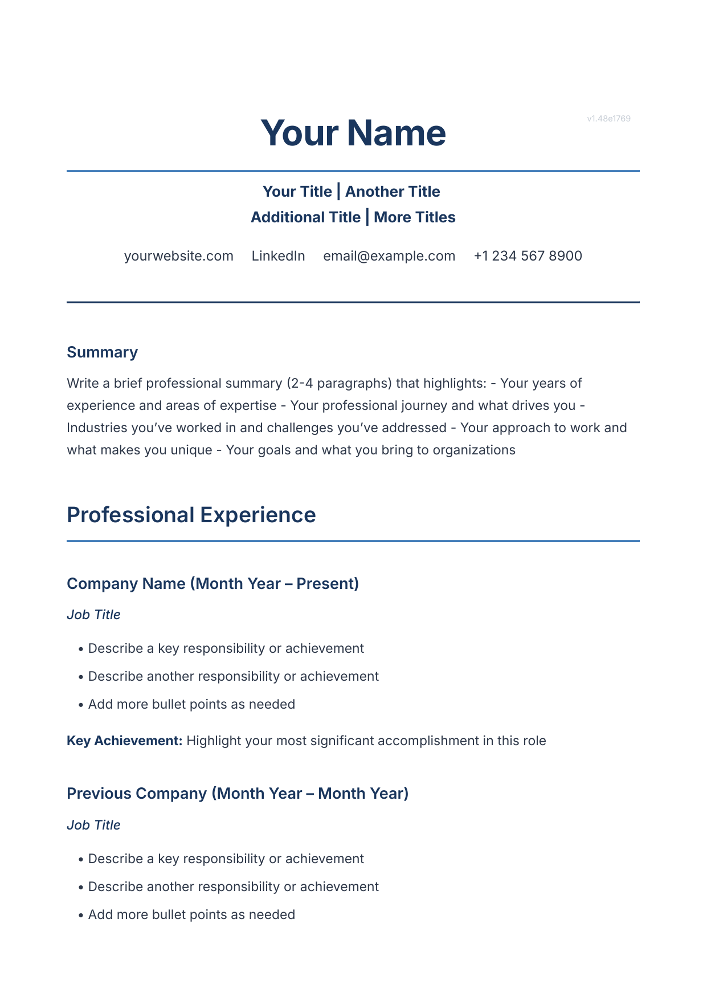
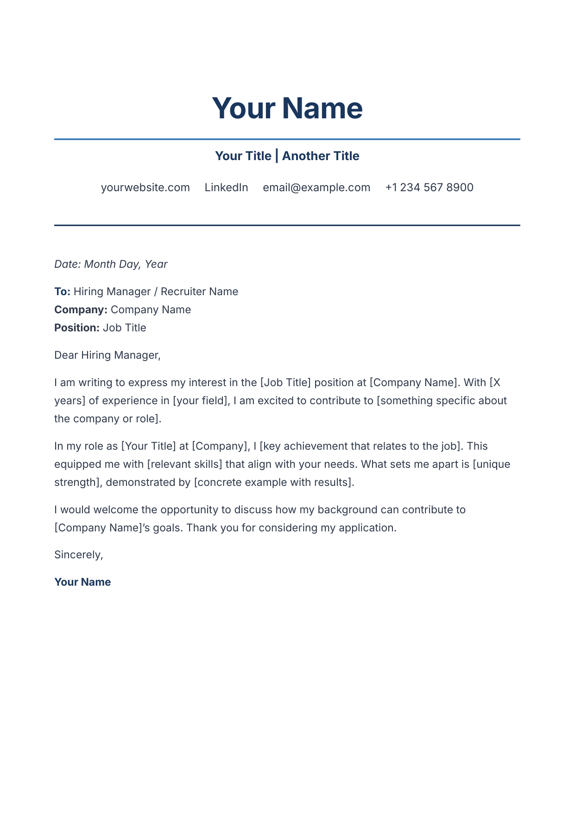

# Resume-as-Code

> Because your career deserves version control too.

Write your resume in Markdown. Get a beautiful PDF. Let robots do the rest.

## What Is This Sorcery?

This repo turns a simple `resume.md` file into a polished, professionally-styled PDF using the unholy trinity of:

- **[Pandoc](https://pandoc.org)** - The Swiss Army knife of document conversion
- **[WeasyPrint](https://weasyprint.org)** - Turns HTML+CSS into PDFs like a boss
- **[Nix Flakes](https://nixos.wiki/wiki/Flakes)** - Reproducible builds that work on your machine, my machine, and GitHub's machines

No more wrestling with Word. No more "can you send me a PDF?" emails. Just `git push` and your resume magically appears on GitHub Pages.

## Templates

Get started quickly with these professionally-styled templates:

<table>
<tr>
<td align="center" width="50%">

### Resume Template

[](templates/template-resume.pdf)

[**Download PDF**](templates/template-resume.pdf) · [View Markdown](templates/template-resume.md)

</td>
<td align="center" width="50%">

### Cover Letter Template

[](templates/template-cover-letter.pdf)

[**Download PDF**](templates/template-cover-letter.pdf) · [View Markdown](templates/template-cover-letter.md)

</td>
</tr>
</table>

## The Pipeline

```
resume.md  →  Pandoc  →  HTML  →  WeasyPrint  →  resume.pdf  →  GitHub Pages
    ↑                                                              ↓
  You edit                                               Recruiters download
```

## Quick Start

### Prerequisites

You need [Nix](https://nixos.org/download.html) with flakes enabled. That's it. No Python version conflicts. No "works on my machine." Just Nix.

### Build Locally

```bash
# Build PDF (default: resume.md → resume.pdf)
nix run .#pdf

# Build a different file
nix run .#pdf -- my-other-resume.md

# Build HTML for previewing
nix run .#html

# Enter a dev shell with pandoc and weasyprint available
nix develop
```

### Customize

1. Edit `resume.md` - it's just Markdown
2. Tweak `resume-style.css` - make it yours
3. Push to `main` - GitHub Actions handles the rest

## Project Structure

```
.
├── resume.md                       # Your resume in Markdown
├── resume-style.css                # CSS that makes it pretty
├── flake.nix                       # Nix magic (builds on any platform)
├── templates/
│   ├── template-resume.md          # Resume template
│   ├── template-cover-letter.md    # Cover letter template
│   ├── template-resume-preview.png # Auto-generated preview
│   └── template-cover-letter-preview.png
├── images/                         # Screenshots, thumbnails, etc.
└── .github/workflows/              # CI/CD pipeline for auto-builds
```

## How It Works

### Local Build Flow

The `flake.nix` defines two apps:
- `pdf` - Pipes Markdown through Pandoc (outputs HTML) → WeasyPrint (outputs PDF)
- `html` - Just the Pandoc step for quick previews

### CI/CD Flow

On every push to `main`:
1. GitHub Actions spins up an Ubuntu runner
2. Installs Nix (using [Determinate Systems' installer](https://github.com/DeterminateSystems/nix-installer-action))
3. Runs `nix run .#pdf`
4. Uploads the PDF as an artifact
5. Deploys to GitHub Pages

Your resume is now always one click away at your GitHub Pages URL.

## Why Nix?

Because dependency hell is real, and Nix is the escape pod.

- Works identically on macOS (Intel & Apple Silicon) and Linux
- No "install Python 3.12 and pip install weasyprint and hope for the best"
- CI and local builds use the exact same toolchain
- It's 2026, we have flying cars and reproducible builds

## Styling Tips

The CSS uses CSS variables for easy theming:

```css
:root {
    --primary: #1a365d;    /* Headers, section titles */
    --accent: #2b6cb0;     /* Links, highlights */
    --text: #2d3748;       /* Body text */
    --text-light: #718096; /* Secondary text */
}
```

The stylesheet handles:
- Responsive layout (mobile-friendly HTML preview)
- Print optimization (clean PDF output)
- Special formatting for contact info, skills, and publications

## Pro Tips

- **Images**: Add video thumbnails or project screenshots in `images/`
- **Multiple Resumes**: Keep `aws-resume.md`, `startup-resume.md`, etc. and build any of them
- **Version History**: Git blame your career progression
- **Rollbacks**: Accidentally deleted that job you hated? `git revert`

## License

MIT - Do whatever you want with this setup. Your resume content is yours.

---

*Built with Markdown, powered by Nix, deployed by robots.*
