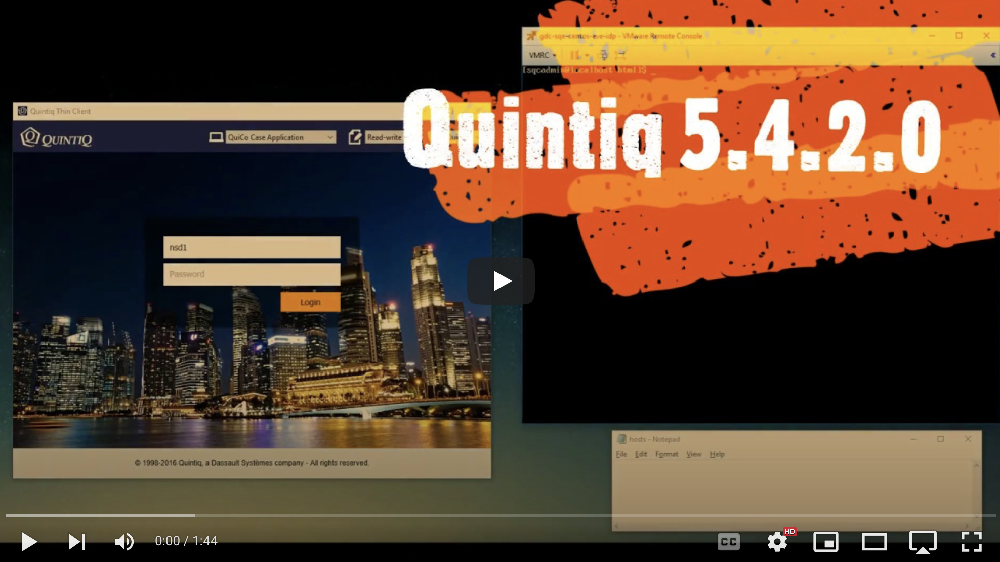
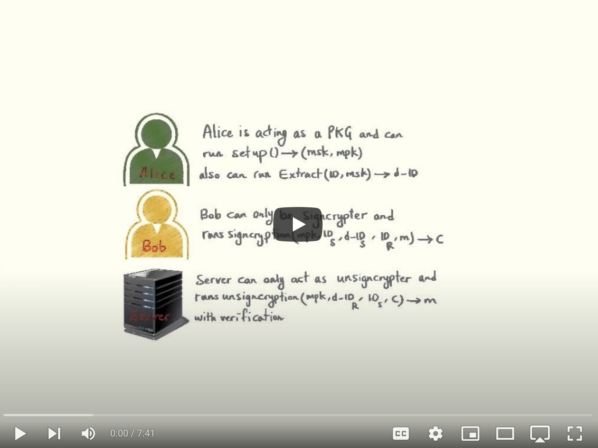

# Nima Saed {.resume-name}

**Application Security Architect | Software Security Engineer   Ethical Hacker | DevSecOps Engineer | Cloud Security Engineer**

- [nmsd.xyz](https://nmsd.xyz)
- [LinkedIn](https://www.linkedin.com/in/nimasaed/)
- [nima@nmsd.xyz](mailto:nima@nmsd.xyz)
- [00 31 6 14 61 20 95](tel:0031-6-14-61-20-95)

## Summary

I am a security expert with 19 years of experience in IT, including 13 years specializing in software and cloud security. My expertise lies in securing critical systems, particularly in authentication, authorization, and cryptography. I excel at automating security processes and integrating them into modern software development lifecycles (SSDLC).

My journey into cybersecurity started during my teenage years, sparked by a fascination with hacking and defense mechanisms. Friendly "Capture the Flag" competitions fueled my curiosity about how systems operate—and how to secure them. To deepen my expertise, I pursued formal education in security technology and cryptography.

Over my career, I've collaborated across industries such as healthcare, education, manufacturing, and technology—addressing their unique privacy, IT, and OT security challenges. My approach centers on making security a seamless enabler for innovation by championing automation and simplicity.

As a trainer and mentor, I am passionate about empowering teams to adopt secure development practices and strengthen their security postures. Whether through penetration testing, threat modeling, or building secure cloud infrastructures, my goal is to ensure businesses thrive in the digital age while staying secure.

# Professional Experience

## ANVA (May 2024 – Present)

**Security Architect**

- Led security architecture for a greenfield multi-tenant SaaS platform on AWS
- Architected a compliant, tamper-evident audit log pipeline for multi-tenant SaaS on AWS Fargate, supporting SOC 2/ISO 27001 requirements with cryptographic integrity verification and immutable storage
- Designed an OCSF-aligned audit event schema and Spring Boot SDK with AOP-based annotations, enabling unified security operations across application and infrastructure logs
- Built a centralized fine-grained authorization (FGA) engine using OpenFGA, supporting RBAC, ABAC, and ReBAC models with policy-as-code deployment through CI/CD pipelines
- Designed multi-tenant authorization architecture with strict tenant isolation, enabling per-tenant customizable roles and permissions while ensuring secure data separation across organizational boundaries
- Integrated process-driven access control with the rule engine, automatically aligning permissions with business process stages to reduce manual role management and minimize over-permissioning risks
- Architected a Spring Cloud Gateway-based API gateway for secure external partner integrations, featuring fine-grained endpoint exposure control, structured usage tracking, and a self-service configuration model enabling teams to manage their API exposure through PRs
- Established threat modeling as a core security practice by developing training for developer onboarding and conducting design-phase threat modeling to identify vulnerabilities before implementation

**Key Achievement:** Designed and built an OpenFGA-based authorization engine enabling fine-grained, per-tenant access control across the platform

## Xebia (Nov 2021 – April 2024)

**Security Consultant**

- Provided consultancy services in digital transformation and security processes across diverse industries
- Automated security checks in CI/CD pipelines
- Conducted AWS cloud security assessments and enhanced infrastructure security
- Performed penetration tests, secure code reviews, and threat modeling for application designs
- Delivered training on AWS security, application security, and DevSecOps practices

**Key Focus:** Making security an enabler through automation and simplicity, empowering clients to strengthen their security posture effectively

## 247TailorSteel (Dec 2019 – Oct 2021)

**Information Security Engineer**

- Integrated API security scans into development pipelines
- Designed a secure authentication and authorization platform for a customer portal
- Implemented automated network vulnerability scans for OT security, identifying factory floor vulnerabilities

**Key Focus:** Bridging the gap between operational technology (OT) and modern IT security practices by integrating OT security into the broader security strategy and automating vulnerability detection on factory networks

## Dassault Systèmes (Sep 2016 – Dec 2019)

**Software Security Engineer**

- Conducted penetration tests on in-house software and services
- Advocated for a shift-left approach in the SDLC, embedding security into design and testing phases

**Key Achievement:** Identified critical vulnerabilities in SAML authentication before release

## Multimedia University (Sep 2014 – Aug 2016)

**Research Assistant & Tutor**

- Conducted research in cryptography and searchable encryption, exploring innovative methods for enhancing security and privacy
- Assisted undergraduate students in C++ programming, data structures, and web technologies

**Key Contributions:**

- Designed Public Key Encryption with Keyword Search (PEKS) Scheme ([link](https://docs.google.com/document/d/1Lhy_PnInp-IzHgyPo7FE3gm5dPC_6KA15z4qpzf0Pao/edit?usp=sharing))
- Discovered a method to reuse signcryption schemes in PEKS

## Previous Experience (Jan 2003 – Dec 2009)

**Network Administrator**

- Managed and optimized network performance, security, and overall infrastructure
- Administered firewalls, conducted security monitoring, and implemented network security audits
- Planned and executed LAN network expansion, including server upgrades and Windows Server configuration
- Collaborated with management to develop security policies and provide technical support
- Maintained file server backups, ISA server administration, and general network management

# Education

- **2010 – 2014:** Bachelor of I.T. (Hons) in Security Technology, Multimedia University, Malaysia
- **2014 – 2016:** Cryptography (Research), Multimedia University, Malaysia

## Awards

- ECA MMU Chapter Award for Security Technology, EC-Council, Convocation 2014
    - Issued by Faculty of Information Science and Technology and EC-Council, Multimedia University

- Five Dean Awards
    - Issued by Faculty of Information Science and Technology, Multimedia University

## Publications

**Peer-Reviewed Articles**

1. N. Saed, T.H. Liew, K. Wee, S.Y. Ooi. "[Video and Voice Transmission over LTE Networks](https://ieeexplore.ieee.org/abstract/document/6719970)." *2013 IEEE International Conference on Control System, Computing and Engineering*, 2013.

2. N. Saed, K. Wee, C. Siew-Chin, T.H. Liew, Y.Y. Wee. "[Low Complexity in Exaggerated Earliest Deadline First Approach for Channel and QoS-aware Scheduler](https://www.jocm.us/show-138-743-1.html)." *Journal of Communications*, 9(11), 884-890, 2014.

3. K. Wee, Muhd. Hilmi B.A. H, Y.Y. Wee, N. Saed. "[A Performance Study of Downlink Scheduling Algorithms in Wireless Broadband Networks](https://www.jocm.us/index.php?m=content&c=index&a=show&catid=128&id=625)." *Journal of Communications*, 9(1), 39-47, 2014.

## Skills & Competences

### Security Expertise
- Secure Architecture & Design
- Threat Modeling
- Application Security
- Penetration Testing

### DevSecOps & Development
- Secure Software Development (SSDLC)
- Security Test Automation
- Secure CI/CD Environments

### Cloud & Infrastructure
- AWS Security
- Cloud Security Architecture
- OT/IT Security Integration

### Leadership
- Training and Mentoring
- Security Consulting

## Technologies

### Security Testing & Analysis
Burp Suite, OWASP ZAP, Metasploit, Nessus, OpenVAS

### Cloud & Infrastructure
AWS (IAM, Security Hub, GuardDuty, CloudTrail, Config, KMS, WAF, Shield, Secrets Manager, Inspector, Detective), Terraform, Docker, Podman, Kubernetes, Nix

### Identity & Access Management
OAuth 2.0, SAML, OIDC, OpenFGA, Auth0, Authelia, Keycloak, Okta, Entra ID, ADFS

### CI/CD & DevSecOps
GitHub Actions, GitLab CI, Bitbucket Pipelines, Semgrep, Snyk

### Programming
Python, Bash, Java, C++, JavaScript

## Languages

- English: Fluent
- Persian: Native
- Kurdish: Intermediate
- Chinese: Beginner
- Dutch: Beginner

## Hobbies

- Linux Ricing
- Electronics and Microcontrollers
- Smart Home Automation
- 3D Design and Printing
